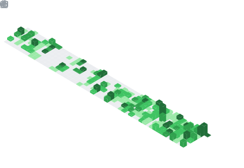

    
   

    

    

    <a href="https://blog.x-lf.com">我的博客</a>
    |
    <a href="https://space.bilibili.com/244321572">我的 B 站</a>
    |
    <a href="https://t.me/xf_talk">Telegram 群组</a>
    |
    <a href="https://qm.qq.com/cgi-bin/qm/qr?k=viCI56D_CRmtKMQZVzKCm9Rhy_0KUwVQ&jump_from=webapi">QQ 群</a>

<h2 align="left">关于我</h2>

<blockquote>
    嘿嘿~ 你好！我是筱锋（XiaoLFeng / xiao_lfeng），目前是一名大四学生，正在努力学习并朝着成为高级软件工程师的目标前进！我对软件工程充满热情，专注于前端开发、后端开发、全栈开发以及项目架构设计。闲暇时间喜欢探索前沿技术，挑战各种复杂的技术难题~ ✨
</blockquote>

    
    

<h3 align="left">技术栈</h3>

***

<h3 align="left">更多关于我</h3>

    <ul>
        <li>🎮 热爱开放、策略和经营类游戏，比如《我的世界》《冰与火之舞》《异星工厂》等等~</li>
        <li>🎵 写代码的时候喜欢听轻音乐，日常生活中也经常听 ACG 音乐。我是个普通的宅宅，特别喜欢东方 Project！博丽灵梦大好き！！！</li>
        <li>👨‍💻 大四刚刚毕业，准备开始下一段精彩的时光~</li>
        <li>📚 闲暇时间喜欢阅读技术博客，不断提升自己的技术水平！</li>
        <li>🌱 正在学习 Golang（Gin 框架和 GoFrame 框架）</li>
        <li>🅱️ 这是我的博客 <a href="https://blog.x-lf.com/">凌中的锋雨</a>，欢迎交换友链哦~</li>
    </ul>

<h2 align="left">联系我</h2>

    <ul>
        <li>✉️ 邮箱：<a href="mailto:gm@x-lf.cn">gm@x-lf.cn</a></li>
        <li>✈ Twitter：<a href="https://twitter.com/lfeng_xiao">筱锋xiao_lfeng</a></li>
        <li>🐧 QQ: 1144939537</li>
    </ul>

<h2 align="center">我的进展</h2>

    
    

欢迎来到我的 GitHub！🍀 如果你对我的代码感兴趣，欢迎一起合作开发哦~

